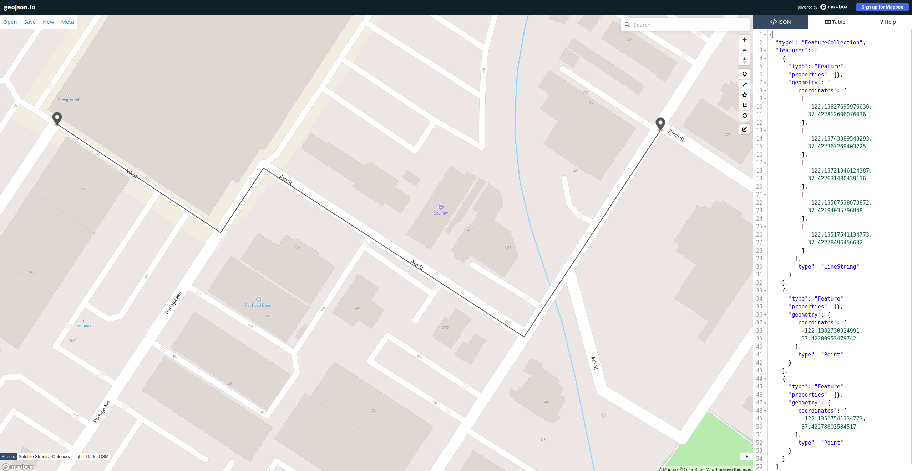

### Routing Engine

This exercise is to build a routing engine that can find the shortest path between two points on a map. The map is represented as a graph, where each node is a point on the map and each edge is a road between two points. The length of an edge is the distance between two points. The routing engine should be able to find the shortest path between two points on the map.

We'll use the road network data from Open Street Maps. You can export an area of the map as an XML file from the [Open Street Maps website](https://www.openstreetmap.org/export#map=17/37.42313/-122.13660). The exported `map.osm` is an XML file containing nodes and ways in the area. A way is a path between nodes. A way can be a road, a river, a railway, etc. Each way has a list of nodes that it connects. Each node has a latitude and longitude. 

So on a top level, the routing engine should be able to do the following:
* Read the map data from an XML file
* Build a graph from the map data
* Your function API should accept start and end points. You can pass them through a test file (provided in the [example](./cpp/osm_routing_test.cpp)).
* Find the shortest path between two points on the map

The output of the program should be saved as a [geojson](https://en.wikipedia.org/wiki/GeoJSON) file. You can visualize it on a [map online](https://geojson.io/#map=16.08/37.422826/-122.135715).

For this exercise, we can limit the points to be exactly same as the node values. And the example route from (`37.42280953479742, -122.1382730924991`) to (`37.42278803584517, -122.13517541134773`) could look like this: 

(Note that these exact points may not exist on the map you export. This is just shown for demostration.)


### Build Instructions

Please share the code and build setup for the routing engine. You can use any build system you like. Please include instructions on how to build and run the code.

We have provided a simple docker setup to build and run the code. You can use this or any other build system you like.

To use the docker setup, you need to have docker installed on your machine. You can install [docker](https://docs.docker.com/engine/install/) and [docker-compose](https://docs.docker.com/compose/install/) to get started.

If you have VScode installed, you can use the devcontainers feature to get started.

#### Logging into the docker container

Start the docker
```
docker-compose -f .devcontainer/docker-compose.yaml up -d
docker exec -it devcontainer_docker_1 /bin/bash
```

Build and test the code

```
cd /code/cpp/
cmake -B build && cmake --build build --target test
```


### Sharing the solution
Please share the C++ code and instructions to build and test your code as a zip file. 
